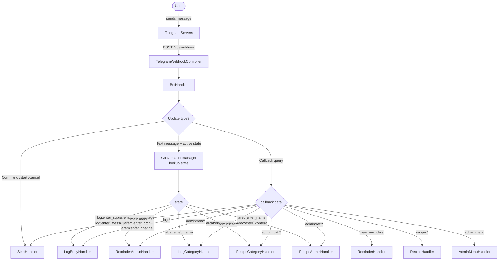
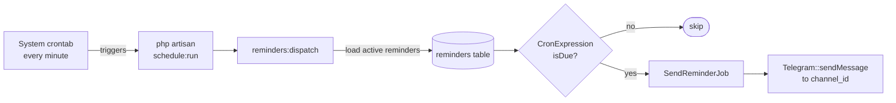

# ReminderViaTelegram — Laravel

A Telegram bot built with Laravel. Supports scheduled reminders, categorized log entries, and a recipe library. Admin-controlled via Telegram user IDs.

## Features

- **Reminders** — cron-scheduled messages sent to any Telegram chat/channel
- **Log entries** — categorized notes created via a multi-step conversation
- **Recipes** — browsable library organized by category
- **Admin panel** — manage all data directly from Telegram (guarded by user ID whitelist)

---

## How it works

This bot uses **webhooks**. When a user sends a message on Telegram, Telegram instantly POSTs the update to your server at `POST /api/webhook`. Laravel handles it, routes it through `BotHandler`, and replies — all within a single HTTP request.



### Conversation state

Telegram is stateless — each webhook call is a fresh HTTP request with no memory of previous messages. Multi-step flows (e.g. adding a reminder requires 3 separate messages) are tracked in the `conversation_states` database table, keyed by Telegram `user_id`.

Each row stores:
- `state` — a namespaced string like `log:enter_subject` or `arem:enter_cron`
- `payload` — a JSON column holding intermediate inputs (e.g. `{"cat_id": 5, "subject": "Meeting notes"}`)

`ConversationManager` reads and writes this table on every request.

### Reminder scheduler

A Laravel artisan command `reminders:dispatch` runs every minute via Laravel's built-in task scheduler. It loads all active reminders from the database, evaluates each one's 5-field cron expression against the current time, and dispatches `SendReminderJob` for any that are due. The job sends the message to the configured Telegram channel/chat.



---

## Database schema

| Table | Purpose |
|---|---|
| `reminders` | Scheduled messages with cron expression and target channel |
| `log_categories` | Categories for log entries |
| `logs` | User-submitted log entries (subject + message) |
| `recipe_categories` | Categories for recipes |
| `recipes` | Recipe name and full content |
| `conversation_states` | Per-user multi-step conversation state |

Reminders use **soft deletes** — the `active` column is set to `0` rather than deleting the row.

---

## Requirements

- PHP 8.2+
- Composer
- SQLite (default) or MySQL
- A public HTTPS URL to receive webhook calls (use [ngrok](https://ngrok.com) for local dev)

---

## Setup

### 1. Install dependencies

```bash
git clone <repo>
cd ReminderViaTelegramLaravel
composer install
```

### 2. Configure environment

```bash
cp .env.example .env
php artisan key:generate
```

Open `.env` and set:

```env
TELEGRAM_BOT_TOKEN=your_bot_token_from_botfather
TELEGRAM_ADMIN_IDS=123456789,987654321
SCHEDULER_TIMEZONE=UTC
```

To get a bot token: open Telegram → search **@BotFather** → `/newbot` → follow the prompts.

To find your Telegram user ID: search **@userinfobot** and send it any message.

### 3. Run migrations

```bash
php artisan migrate
```

### 4. Register the webhook

Telegram needs to know where to send updates. This requires a public HTTPS URL.

**Production:**
```bash
php artisan telegram:set-webhook --url=https://yourdomain.com/api/webhook
```

**Local development with ngrok:**
```bash
# Terminal 1 — start Laravel
php artisan serve

# Terminal 2 — expose it publicly
ngrok http 8000

# Terminal 3 — register the ngrok URL
php artisan telegram:set-webhook --url=https://<your-ngrok-id>.ngrok-free.app/api/webhook
```

### 5. Start the scheduler

Add this single line to your server's crontab (`crontab -e`):

```cron
* * * * * cd /path/to/ReminderViaTelegramLaravel && php artisan schedule:run >> /dev/null 2>&1
```

This runs every minute and fires any reminders that are due.

**Test it manually at any time:**
```bash
php artisan reminders:dispatch
```

### 6. Queue worker (optional)

By default `QUEUE_CONNECTION=sync`, so reminder jobs run inline inside the scheduler command. This is fine for most use cases.

For production with high volume, switch to a real queue:

```env
QUEUE_CONNECTION=database
```

Then run a queue worker:

```bash
php artisan queue:work
```

---

## Architecture

```
app/
├── Console/
│   └── Commands/
│       └── DispatchReminders.php        # Runs every minute, fires due reminders
│
├── Http/
│   └── Controllers/
│       └── TelegramWebhookController.php  # POST /api/webhook — single entry point
│
├── Jobs/
│   └── SendReminderJob.php              # Queued job: sends one Telegram message
│
├── Models/
│   ├── Reminder.php                     # cron_expression, channel_id, active (soft delete)
│   ├── LogCategory.php
│   ├── Log.php                          # subject, message, user_id (Telegram ID)
│   ├── RecipeCategory.php
│   ├── Recipe.php
│   └── ConversationState.php            # user_id, state (string), payload (JSON)
│
└── Telegram/
    ├── BotHandler.php                   # Central router — dispatches every Update
    ├── ConversationManager.php          # Reads/writes conversation_states table
    ├── Guards.php                       # isAdmin() — checks TELEGRAM_ADMIN_IDS
    ├── Keyboards.php                    # Inline keyboard builders
    │
    └── Handlers/
        ├── StartHandler.php             # /start command, main menu
        ├── ReminderHandler.php          # View active reminders (read-only)
        ├── RecipeHandler.php            # Browse categories → list → view
        ├── LogEntryHandler.php          # 3-step: category → subject → message
        │
        └── Admin/
            ├── AdminMenuHandler.php
            ├── ReminderAdminHandler.php  # 3-step: message → cron → channel_id
            ├── LogCategoryHandler.php    # 1-step: name
            ├── RecipeCategoryHandler.php # 1-step: name
            └── RecipeAdminHandler.php    # 3-step: category → name → content

database/
└── migrations/
    ├── ..._create_reminders_table.php
    ├── ..._create_log_categories_table.php
    ├── ..._create_logs_table.php
    ├── ..._create_recipe_categories_table.php
    ├── ..._create_recipes_table.php
    └── ..._create_conversation_states_table.php

routes/
├── api.php        # POST /api/webhook
└── console.php    # Schedule::command('reminders:dispatch')->everyMinute()

config/
├── telegram.php      # SDK config (bot token)
└── telegram-bot.php  # App config (admin_ids, scheduler_timezone)
```

### Conversation state names

| State | Handler | Triggered by |
|---|---|---|
| `log:select_category` | LogEntryHandler | Tapping "New Log Entry" |
| `log:enter_subject` | LogEntryHandler | Selecting a category |
| `log:enter_message` | LogEntryHandler | Typing the subject |
| `arem:enter_message` | ReminderAdminHandler | Tapping "Add Reminder" |
| `arem:enter_cron` | ReminderAdminHandler | Typing the message |
| `arem:enter_channel` | ReminderAdminHandler | Typing a valid cron expression |
| `alcat:enter_name` | LogCategoryHandler | Tapping "Add Category" |
| `arcat:enter_name` | RecipeCategoryHandler | Tapping "Add Category" |
| `arec:select_category` | RecipeAdminHandler | Tapping "Add Recipe" |
| `arec:enter_name` | RecipeAdminHandler | Selecting a category |
| `arec:enter_content` | RecipeAdminHandler | Typing the recipe name |

### Callback data convention

All inline keyboard buttons follow `module:action:param` format:

| Callback data | Action |
|---|---|
| `main:menu` | Return to main menu |
| `view:reminders` | List active reminders |
| `recipe:categories` | Browse recipe categories |
| `recipe:list:{id}` | Recipes in category |
| `recipe:view:{id}` | View a recipe |
| `log:start` | Start log entry flow |
| `log:cat:{id}` | Select log category |
| `admin:menu` | Admin panel |
| `admin:rem:menu` | Manage reminders |
| `admin:rem:add` | Start add-reminder flow |
| `admin:rem:del:{id}` | Soft-delete a reminder |
| `admin:lcat:menu` | Manage log categories |
| `admin:lcat:add` | Add log category |
| `admin:rcat:menu` | Manage recipe categories |
| `admin:rcat:add` | Add recipe category |
| `admin:rec:add` | Start add-recipe flow |
| `admin:rec:cat:{id}` | Select recipe category |

---

## Environment variables

| Variable | Required | Default | Description |
|---|---|---|---|
| `TELEGRAM_BOT_TOKEN` | Yes | — | Bot token from BotFather |
| `TELEGRAM_ADMIN_IDS` | Yes | — | Comma-separated Telegram user IDs |
| `SCHEDULER_TIMEZONE` | No | `UTC` | IANA timezone for cron evaluation (e.g. `Asia/Kolkata`) |
| `QUEUE_CONNECTION` | No | `sync` | `sync`, `database`, or `redis` |
| `DB_CONNECTION` | No | `sqlite` | `sqlite` or `mysql` |
| `DB_DATABASE` | No | `database/database.sqlite` | Path for SQLite or DB name for MySQL |
